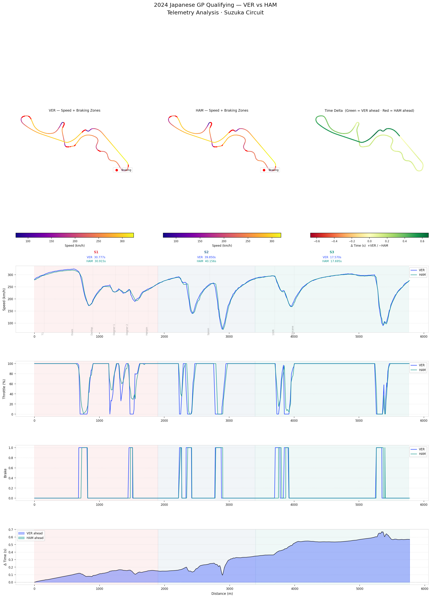

# F1 Telemetry Analysis — 2024 Japanese GP Qualifying

**Comparing Max Verstappen vs Lewis Hamilton · Suzuka Circuit**



---

## Overview

This project uses the [FastF1](https://github.com/theOehrly/Fast-F1) Python library to extract and visualise Formula 1 telemetry data from the 2024 Japanese Grand Prix Qualifying session at Suzuka Circuit.

The analysis compares the fastest qualifying laps of **Max Verstappen (Red Bull)** and **Lewis Hamilton (Mercedes)**, examining speed, throttle application, braking zones, and the cumulative time delta across the full lap.

---

## Key Findings

### Lap Times
| Driver | Lap Time | Gap |
|--------|----------|-----|
| VER (P1) | 1:28.197 | — |
| HAM | 1:29.319 | +1.122s |

### Sector Analysis
| Sector | VER | HAM | Advantage |
|--------|-----|-----|-----------|
| S1 | 30.777s | 30.915s | VER +0.138s |
| S2 | 39.850s | 40.156s | VER +0.306s |
| S3 | 17.570s | 17.695s | VER +0.125s |

VER was faster in every sector — this was not a lap built on one strong section, but consistent marginal gains throughout the entire circuit.

### Circuit Map — Time Delta
The delta map (rightmost circuit diagram) shows the track coloured by the time gap between the two drivers at each point. The track is almost entirely green, meaning VER was ahead from the very first corner and never relinquished the advantage.

Notably, the gap is **smallest through the first Esses complex** (S1, ~600m), where the two drivers were most evenly matched. This is a high-speed, flowing section where car balance matters more than raw braking precision — suggesting HAM was competitive on corner entry speed but lost time on acceleration out of slower corners.

### Speed & Throttle Traces
The speed and throttle traces are strikingly similar in shape — both drivers follow near-identical lines through Suzuka. The time loss for HAM is not concentrated at any single corner but is distributed across the lap as small, repeated delays in throttle application.

The most visible difference appears at the **Hairpin (~1750m)** and **Spoon Curve (~2700m)**, where VER achieves a slightly higher minimum speed on exit, allowing him to carry more speed down the subsequent straights.

### Braking Zones
The braking zone markers (red dots on the circuit maps) show both drivers braking at similar points around the track, confirming that the gap is not coming from dramatically later braking by VER. The difference is in **how quickly each driver gets back to full throttle** after the apex.

### Delta Accumulation
The time delta panel shows VER's advantage growing **gradually and continuously** from lap start to finish. There is a brief narrowing of the gap around **2800–3000m** (the Hairpin exit into the back straight), but VER immediately re-extends his lead through Spoon and 130R.

By the final chicane, VER's advantage has grown to over **0.6 seconds** — a large margin in qualifying, where drivers are at the absolute limit of car performance.

---

## Technical Notes

- **FastF1 version note:** `pick_driver()` is deprecated in FastF1 ≥ 3.3 — this project uses `pick_drivers()` throughout
- **Position data:** Circuit map X/Y coordinates are obtained via `get_pos_data()` and merged onto telemetry using `merge_channels()`
- **Delta calculation:** Time delta is computed using `fastf1.utils.delta_time()`, which aligns the two laps by distance and calculates the cumulative time gap at each point
- **Colormaps:** Speed maps use `plasma`; delta map uses `RdYlGn` centred at zero (green = VER ahead, red = HAM ahead)

---

## How to Run

```bash
# 1. Clone the repo
git clone https://github.com/YOUR_USERNAME/f1-telemetry-analysis.git
cd f1-telemetry-analysis

# 2. Install dependencies
pip install -r requirements.txt

# 3. Run the analysis
python analysis.py
```

The script will download session data on first run (cached to `f1_cache/` for subsequent runs) and save the chart to `outputs/`.

---

## Project Structure

```
f1-telemetry-analysis/
├── analysis.py          # Main analysis script
├── requirements.txt     # Python dependencies
├── README.md            # This file
├── f1_cache/            # FastF1 session cache (auto-created, gitignored)
└── outputs/
    └── japan_gp_qualifying_VER_HAM_final.png
```

---

## Part of a Larger Portfolio

This is **Project 1** of a 5-project F1 data science portfolio targeting roles in motorsport analytics:

| # | Project | Skills |
|---|---------|--------|
| ✅ 1 | Telemetry Analysis (this project) | FastF1, matplotlib, time-series visualisation |
| 2 | Circuit Dominance Map | Geospatial plotting, comparative analysis |
| 3 | Tire Compound Classifier | scikit-learn, classification |
| 4 | Pit Stop Strategy Optimizer | optimisation, simulation |
| 5 | Qualifying Lap Predictor | regression, feature engineering |

---

## Data Source

All data is sourced from the official F1 timing feed via the [FastF1](https://github.com/theOehrly/Fast-F1) library. FastF1 is an open-source Python package that provides access to F1 timing, telemetry, and positional data.
